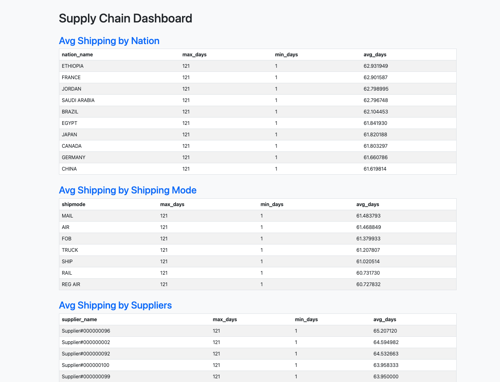

# TPC-H Supply Chain Analytics Pipeline

An end-to-end Data Engineering pipeline built to analyze supply chain efficiency using the TPC-H dataset. This project implements a **Medallion Architecture** (Bronze, Silver, Gold) to transform raw relational data into actionable business insights.



## Tech Stack
* **Database:** [DuckDB](https://duckdb.org/) (In-process OLAP database)
* **Data Processing:** [Polars](https://pola.rs/) (Lightning-fast DataFrame library)
* **Orchestration:** Apache Airflow (Logic-ready)
* **Environment:** GitHub Codespaces / Python 3.12

## Data Architecture (Medallion Layers)
To ensure data quality and traceability, the project is organized into three distinct schemas within `tpch.db`:

1.  **Bronze (Raw):** Direct ingestion of the TPC-H source tables (`orders`, `lineitem`, `supplier`, `nation`).
2.  **Silver (Refined):** Data cleaning, renaming (removing TPC-H prefixes), and joining. Includes:
    * `fct_shipping`: Combined logistics data.
    * `dim_supplier`: Enriched supplier information.
3.  **Gold (Curated):** Business-level aggregates and One Big Tables (OBT) optimized for the dashboard:
    * `agg_nation`: Average shipping delays per country.
    * `agg_shipmode`: Performance metrics by transportation method.
    * `agg_supplier`: Performance metrics by supplier.

## 🚀 Key Features
* **Automated ETL:** Python-based scripts that handle the extraction and transformation without manual SQL overhead.
* **Lock-Safe Connections:** Implemented context managers (`with duckdb.connect`) to prevent database file locking during concurrent tasks.
* **Dynamic Dashboard:** A custom-built HTML reporting tool that generates visual summaries of the Gold-layer metrics.

## 📈 Dashboard Preview
The pipeline generates a `dashboard.html` featuring:
* **Global Shipping Performance:** Identifying which nations experience the highest logistics latency.
* **Supplier Benchmarking:** Ranking the slowest suppliers based on real shipping data.
* **Shipping Mode Benchmarking:** Ranking the slowest shipping mode based on shipping length.

## 🏃 How to Run
1. **Install Dependencies:**
   ```bash
   pip install -r requirements.txt
   ```
2. **Run the Pipeline:**
  ```bash
   python3 run_pipeline.py
   ```
3. **Generate Report:**
  ```bash
   python3 models/generate_dashboard.py
   ```
